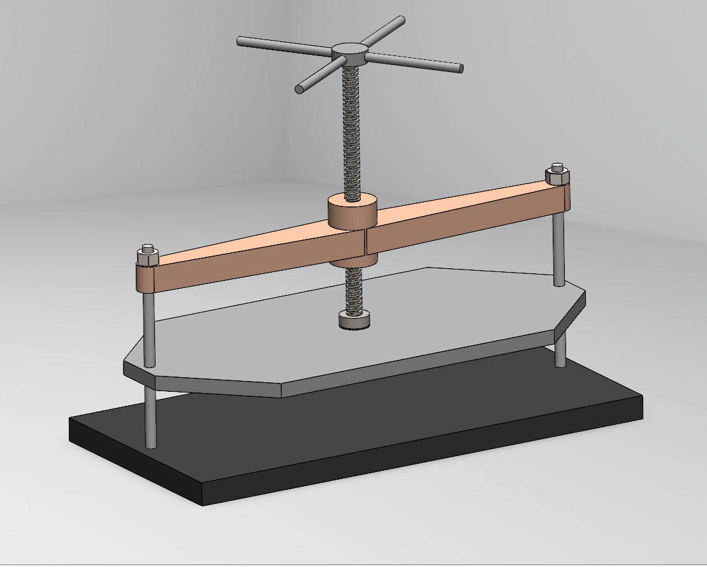
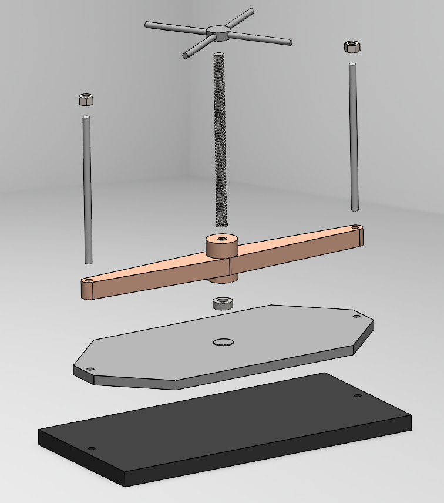

# Screw Press

A 3D CAD design and mechanical assembly of a screw press developed using SOLIDWORKS.

## Project Overview

This project involved the 3D modeling and assembly of a screw press. The assembly consists of multiple mechanical components including the base, columns, handle, main screw, movable jaw, support bar and a thrust bearing.

The assembly was designed with functional mates to allow the screw and the jaw to move according to the intended mechanism while maintaining appropriate movement limits and avoiding unwanted interference.

## Software

- SOLIDWORKS

## Key Features

- 3D part modeling
- Mechanical assembly
- Assembly mates and constraints
- Controlled jaw movement
- Lead screw mechanism
- Interference detection
- Exploded assembly view
- Bill of Materials (BOM)
- Engineering assembly drawing
- STEP CAD export

## Assembly

## Exploded View

## Engineering Drawing

The assembly drawing includes:

- Orthographic views
- Isometric view
- Assembly dimensions
- Bill of Materials
- Balloons
- Title block

The engineering drawing is available in the `drawings` folder.

## CAD File

A STEP version of the complete assembly is provided in the `CAD` folder for universal CAD compatibility.

## Skills Demonstrated

- SOLIDWORKS 3D modeling
- Mechanical assembly
- Assembly constraints and mates
- Mechanical motion
- Interference checking
- Engineering drawing creation
- BOM creation
- CAD file preparation and export
